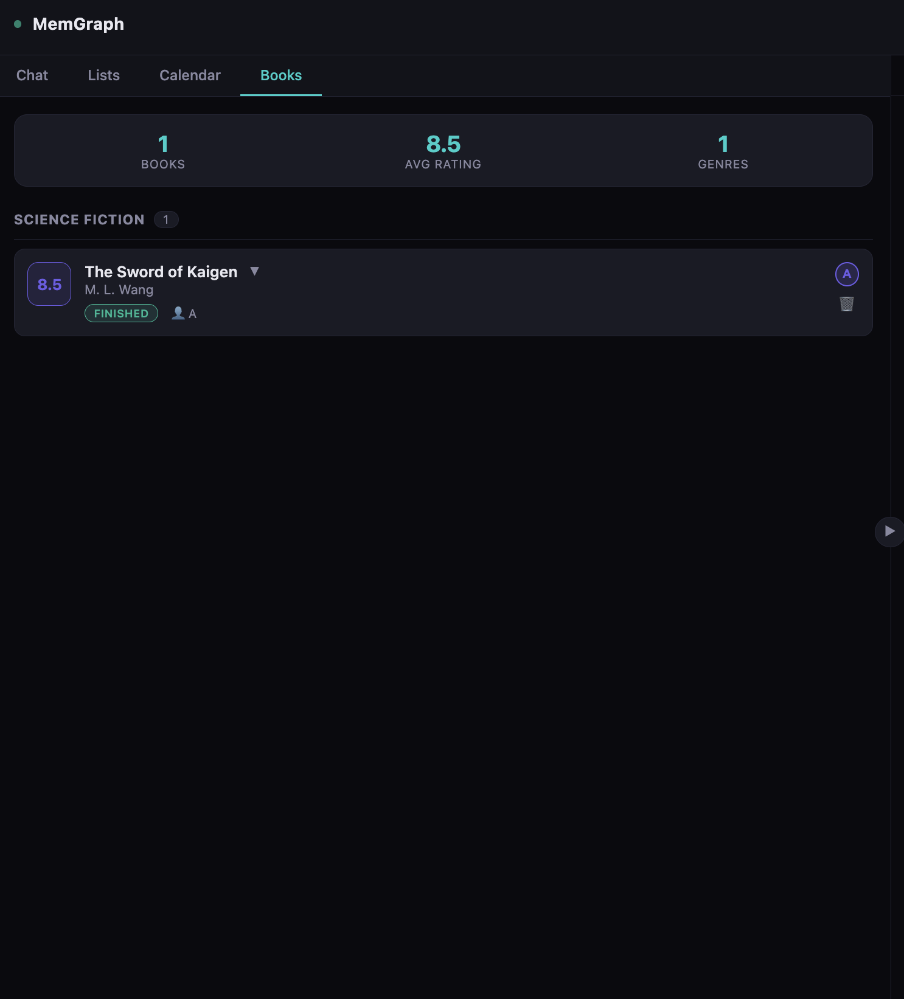

# MemGraph Agent

A local AI assistant for Apple Silicon Macs that runs entirely on-device using MLX, with graph-based long-term memory powered by Neo4j + Qdrant hybrid search and built-in household tools.




## Features

- **Local LLM inference via MLX** -- Qwen3.5-9B for chat, Qwen3-1.7B for background tasks (tag/fact extraction). No API keys, no cloud dependency.
- **Hybrid RAG retrieval** -- Qdrant embedded with dense (NomicBERT) + sparse (BM25) search fused via Reciprocal Rank Fusion. Significantly better recall than single-vector search.
- **Graph-based memory** -- Episodic memories (raw conversation turns) and semantic memories (extracted facts, consolidated beliefs) with Neo4j graph relationships.
- **Dual-store architecture** -- Neo4j for graph structure (nodes, edges, visualization), Qdrant for all vector search (retrieval, dedup, linking).
- **Household tools** -- Grocery lists, notes, calendar events, expense tracking, books, weather, and web search (16 built-in tools).
- **Google Calendar integration** -- Push-only: events created via the agent automatically appear in your Google Calendar.
- **Push notifications via ntfy.sh** -- Get notified on your phone when the grocery list is updated or the weekly expense report is generated.
- **Weekly expense reports** -- Auto-generated every Sunday at 09:00 via APScheduler, saved to `data/reports/` and sent as a push notification.
- **Real-time graph visualization** -- D3.js-powered interactive view of your memory graph.
- **SSE streaming** -- Chat responses stream token-by-token for a responsive experience.
- **Mobile-friendly responsive UI** -- Access from your phone on the same WiFi network.

## Architecture

```
Browser (phone / desktop)
   |
   |  HTTP / SSE
   v
FastAPI server (server.py)
   |
   |-- MLX LLM inference (on-device, Apple Silicon GPU)
   |     |-- Qwen3.5-9B-MLX-4bit  (chat + tool calling)
   |     |-- Qwen3-1.7B-4bit      (background: tags, facts, classification)
   |     |-- NomicBERT             (embeddings, 768-dim)
   |
   |-- Neo4j (graph structure only)
   |     |-- Episodic nodes   (raw conversation turns)
   |     |-- Semantic nodes   (extracted facts, consolidated beliefs)
   |     |-- Edge types: CAUSED_BY, CONTRADICTS, GENERALIZES,
   |     |               RELATED_TO, PRECEDES, REINFORCES
   |     |-- D3.js visualization data
   |
   |-- Qdrant embedded (all vector search)
   |     |-- Dense vectors   (768-dim NomicBERT, cosine)
   |     |-- Sparse vectors  (BM25 via FastEmbed)
   |     |-- Hybrid search   (RRF score fusion)
   |     |-- Filtered search (by type, topic, confidence)
   |
   |-- Tool execution (lists, notes, calendar, expenses, books, weather, web search)
   |
   |-- Background processing (after each response)
   |     |-- Tag extraction
   |     |-- Fact extraction (personal details, preferences, habits)
   |     |-- Topic classification
   |     |-- Consolidation (promote recurring patterns to semantic nodes)
   |     |-- Deduplication (merge near-duplicate semantic nodes)
   |     |-- Edge classification (LLM-chosen relationship types)
   |
   |-- APScheduler
         |-- Weekly expense report (Sunday 09:00)
```

### Memory Lifecycle

1. **Write** -- every conversation turn becomes an Episodic node (Neo4j) + vector (Qdrant)
2. **Link** -- new nodes connected to related existing nodes via Qdrant similarity → Neo4j edges
3. **Promote** -- when a tag appears in ≥3 episodes, they're consolidated into a Semantic node
4. **Read** -- on each turn, Qdrant hybrid search retrieves relevant memories for the system prompt
5. **Reinforce** -- existing semantic nodes gain confidence when more evidence arrives

### Edge Types

| Edge | Meaning |
|------|---------|
| `RELATED_TO` | Loose thematic connection |
| `PRECEDES` | Temporal ordering |
| `GENERALIZES` | Semantic node abstracts episodic ones |
| `REINFORCES` | Adds confidence to a belief |
| `CONTRADICTS` | Conflicting memories |
| `CAUSED_BY` | Causal link |

## Prerequisites

- **Apple Silicon Mac** (M1/M2/M3/M4) -- required for MLX
- **Python 3.10+**
- **Neo4j** (via Docker or Homebrew)
- **Docker** (recommended for running Neo4j)
- **Git**

## Quick Start

1. **Clone the repo**

   ```bash
   git clone https://github.com/NamrataChakka/MemGraph-Agent.git
   cd MemGraph-Agent
   ```

2. **Create and activate a virtual environment**

   ```bash
   python3 -m venv venv
   source venv/bin/activate
   ```

3. **Install dependencies**

   ```bash
   pip install -r requirements.txt
   ```

   For optional features, also install:

   ```bash
   # Google Calendar integration
   pip install google-api-python-client google-auth-oauthlib

   # Weekly scheduled reports
   pip install apscheduler
   ```

4. **Start Neo4j**

   ```bash
   docker run -d \
     --name memgraph-neo4j \
     -p 7474:7474 -p 7687:7687 \
     -v memgraph-neo4j-data:/data \
     -e NEO4J_AUTH=neo4j/password \
     neo4j:latest
   ```

   Wait a few seconds for Neo4j to initialize. You can verify it's ready at http://localhost:7474.

5. **Create a `.env` file**

   ```bash
   cp .env.example .env
   ```

   Edit `.env` with your settings:

   ```env
   NEO4J_URI=bolt://localhost:7687
   NEO4J_USER=neo4j
   NEO4J_PASSWORD=password
   MLX_MODEL_PATH=mlx-community/Qwen3.5-9B-MLX-4bit
   MLX_SMALL_MODEL_PATH=mlx-community/Qwen3-1.7B-4bit
   QDRANT_PATH=./qdrant_data
   ```

6. **Run the server**

   ```bash
   python server.py
   ```

   Or use the convenience script (auto-starts Neo4j, downloads models if needed):

   ```bash
   bash start.sh
   ```

7. **Open the UI**

   Navigate to http://localhost:8000 in your browser.

## Accessing from Your Phone

You can use MemGraph Agent from any device on your local network.

1. **Find your Mac's local IP address:**

   ```bash
   ipconfig getifaddr en0
   ```

   This returns something like `192.168.1.42`.

2. **On your phone's browser, go to:**

   ```
   http://192.168.1.42:8000
   ```

3. **Both devices must be on the same WiFi network.**

4. **Tip:** Bookmark the URL or use your browser's "Add to Home Screen" option for an app-like experience.

## Configuration

All settings are read from environment variables (`.env` file).

| Variable | Default | Description |
|----------|---------|-------------|
| `NEO4J_URI` | `bolt://localhost:7687` | Neo4j Bolt connection URI |
| `NEO4J_USER` | `neo4j` | Neo4j username |
| `NEO4J_PASSWORD` | `password` | Neo4j password |
| `MLX_MODEL_PATH` | `mlx-community/Qwen3.5-9B-MLX-4bit` | Main chat model (HuggingFace repo ID or local path) |
| `MLX_SMALL_MODEL_PATH` | `mlx-community/Qwen3-1.7B-4bit` | Small model for background tasks (tag/fact extraction) |
| `QDRANT_PATH` | `./qdrant_data` | Directory for Qdrant embedded vector storage |
| `DATA_DIR` | `data` | Directory for persistent tool data (lists, notes, events, expenses) |
| `NTFY_TOPIC` | *(empty -- disabled)* | ntfy.sh topic name for push notifications |
| `NTFY_SERVER` | `https://ntfy.sh` | ntfy server URL (can self-host) |
| `GOOGLE_CREDENTIALS_FILE` | `data/credentials.json` | Path to Google OAuth client credentials |
| `GOOGLE_TOKEN_FILE` | `data/google_token.json` | Path to store Google access/refresh token |
| `GOOGLE_CALENDAR_ID` | `primary` | Target Google Calendar ID |
| `AUTH_USERNAME` | *(empty -- disabled)* | Username for web UI authentication |
| `AUTH_PASSWORD` | *(empty -- disabled)* | Password for web UI authentication |

## Notification Setup (ntfy.sh)

[ntfy.sh](https://ntfy.sh) is a free, open-source push notification service. No account required.

1. Install the **ntfy** app on your phone:
   - [iOS (App Store)](https://apps.apple.com/app/ntfy/id1625396347)
   - [Android (Play Store / F-Droid)](https://ntfy.sh)

2. Pick a unique topic name (e.g. `myhome-abc123`). Anyone who knows the topic name can subscribe, so make it hard to guess.

3. In the ntfy app, subscribe to your chosen topic.

4. Add to your `.env` file:

   ```env
   NTFY_TOPIC=myhome-abc123
   ```

5. Notifications are sent when:
   - The grocery list is updated
   - The weekly expense report is generated (every Sunday at 09:00)

## Google Calendar Setup (Optional)

This enables push-only integration -- events created via the agent automatically appear in your Google Calendar.

1. Go to the [Google Cloud Console](https://console.cloud.google.com/) and create a new project (or use an existing one).

2. Enable the **Google Calendar API** (APIs & Services > Library > search "Calendar API").

3. Create **OAuth 2.0 credentials**:
   - APIs & Services > Credentials > Create Credentials > OAuth client ID
   - Application type: **Desktop app**
   - Download the credentials JSON file.

4. Save the credentials file to `data/credentials.json` (or the path set in `GOOGLE_CREDENTIALS_FILE`).

5. On first run, a browser window will open for one-time authorization. After you approve, a refresh token is saved to `data/google_token.json` and subsequent runs authenticate automatically.

6. Events created via the agent (e.g. "Add dentist appointment on Friday") will automatically appear in your Google Calendar.

## Available Tools

The agent has access to 20 built-in tools:

| Tool | Description |
|------|-------------|
| `web_search` | Search the web via DuckDuckGo for up-to-date information |
| `list_view` | View all items in a named list (e.g. grocery, todo, shopping) |
| `list_add` | Add one or more items to a named list |
| `list_remove` | Remove one or more items from a named list |
| `list_clear` | Remove all items from a named list |
| `lists_all` | Show all lists and their contents |
| `note_write` | Create or overwrite a note by title |
| `note_read` | Read a note by title |
| `note_list` | List all saved note titles |
| `note_delete` | Delete a note by title |
| `weather_get` | Get current weather for a location (via wttr.in, no API key needed) |
| `event_add` | Add an event to the household calendar (also pushes to Google Calendar) |
| `events_list` | List upcoming calendar events (default: next 14 days) |
| `event_delete` | Delete a calendar event by title and date |
| `expense_add` | Log a household expense with amount, category, and description |
| `expenses_summary` | Summarize expenses by category for the last N days |
| `book_add` | Add a book to the reading tracker (auto-enriched via Open Library) |
| `book_list` | List all books, optionally filtered by genre or reader |
| `book_update` | Update a book's details (rating, dates, summary, etc.) |
| `book_delete` | Remove a book from the reading tracker |

## Project Structure

```
MemGraph/
├── server.py              # FastAPI app, endpoints, SSE streaming, dual-store init
├── start.sh               # Convenience startup script (Neo4j + models + server)
├── requirements.txt       # Python dependencies
├── .env.example           # Example environment config
├── clean_graph.py         # Utility to clean/reset the graph database
├── core/
│   ├── __init__.py        # Package exports
│   ├── agent.py           # Chat agent with memory-augmented prompts + tool calling
│   ├── memory.py          # Graph store, LLM client, memory engine (dual-store)
│   ├── vectorstore.py     # Qdrant embedded wrapper (hybrid dense+sparse search)
│   ├── tools.py           # Tool schemas and execution dispatch (20 tools)
│   ├── notify.py          # Push notifications via ntfy.sh
│   ├── gcal.py            # Google Calendar push integration
│   └── scheduler.py       # APScheduler for weekly reports
├── templates/
│   └── index.html         # Chat UI with graph visualization
└── data/                  # Persistent storage (created at runtime)
    ├── lists.json         # Named lists (grocery, todo, etc.)
    ├── notes.json         # User notes
    ├── events.json        # Calendar events
    ├── expenses.json      # Expense log
    ├── books.json         # Reading tracker
    ├── credentials.json   # Google OAuth credentials (you provide this)
    ├── google_token.json  # Google auth token (auto-generated)
    └── reports/           # Weekly expense reports (Markdown)
```

## Migration from Previous Version

If you have an existing Neo4j graph with embeddings, the server automatically migrates vectors to Qdrant on first startup. No manual steps needed.

To manually clean and re-index:

```bash
python clean_graph.py
```

This will backfill Qdrant, deduplicate semantic nodes, and reclassify all edges.

## Troubleshooting

**Neo4j connection refused**
Make sure the Docker container is running:
```bash
docker ps | grep neo4j
docker start memgraph-neo4j
```

**MLX model download takes a long time**
The first run downloads models from HuggingFace (~5GB total). This is a one-time download. Subsequent runs use the cached models.

**Phone can't connect**
- Verify both devices are on the same WiFi network.
- Check your Mac's firewall: System Settings > Network > Firewall. Either disable it or allow incoming connections on port 8000.
- Make sure you're using `http://` (not `https://`).

**Google Calendar auth fails**
- Ensure `data/credentials.json` exists and is a valid OAuth client credentials file.
- Delete `data/google_token.json` and restart the server to re-authenticate.
- Make sure the Calendar API is enabled in your Google Cloud project.

## License

MIT
